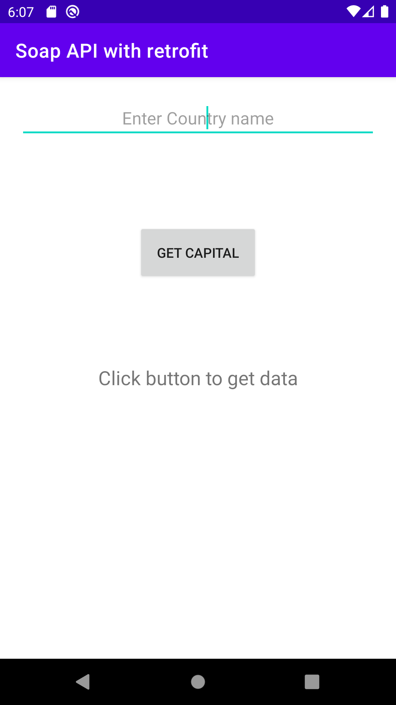
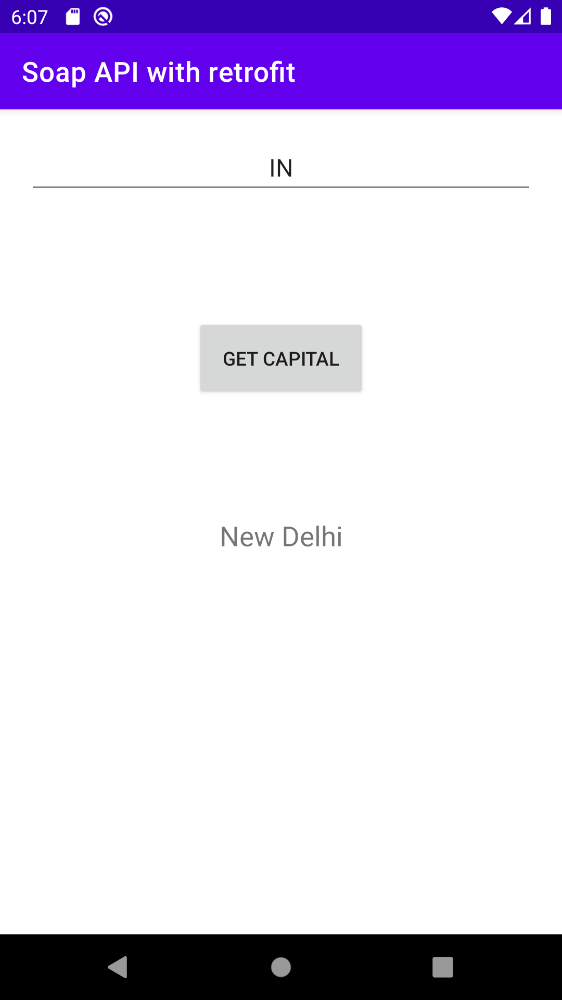

# Soap API With Retrofit
> Soap api can be consume with retrofit library

## Table of Contents
* [General Info](#general-information)
* [Technologies Used](#technologies-used)
* [Features](#features)
* [Screenshots](#screenshots)
* [Setup](#setup)
* [Usage](#usage)
* [Contact](#contact)
<!-- * [License](#license) -->

## General Information
- Now a days very less anpod app used the SOAP API so it was verdy difficult to me to work with retrofit for SOAP api. There are very few articals which have information soap with reftroft so tried to demonstrate the information here

## Technologies Used
- MVVM architecture
- Java
- Dependency Injection: Android Hilt
- ViewModel
- LiveData
- Lifecycle components

## Features
List of ready features here:
- Soap API
- Retrofit Library 

## Screenshots
        
<!-- If you have screenshots you'd like to share, include them here. -->

## Setup
Nothing such as important to setup the things here, Its just straight forward

## Usage
- It will help in case of consumning the SOAP API using retrofit
- Example of data
    - Input data required is first 2 captal letter of country (example: "IN")
    - Outpout Capital city of provided country (Example: "Delhi")

## Contact
Created by [@Sandeep](https://sandeepksatpute.wixsite.com/resume) - feel free to contact me!

<!-- Optional -->
<!-- ## License -->
<!-- This project is open source and available under the [... License](). -->

<!-- You don't have to include all sections - just the one's relevant to your project -->
